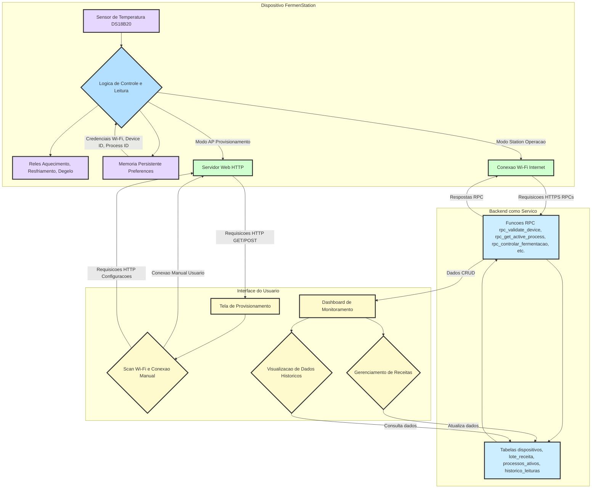
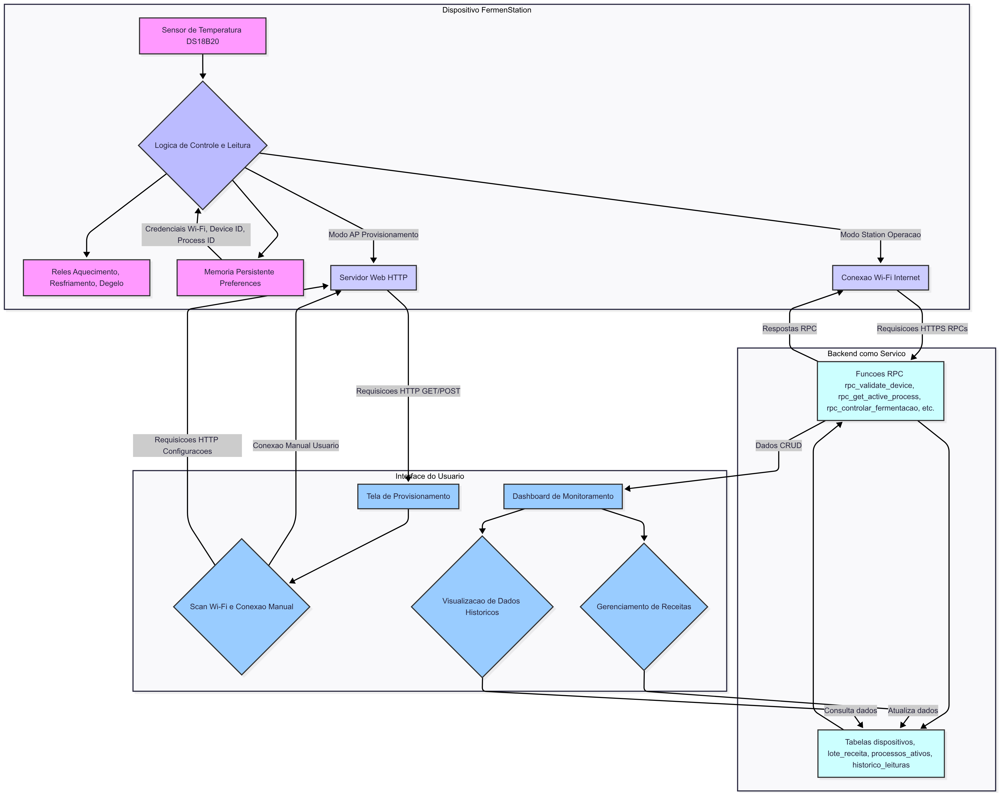

# 🍺 FermenStation


> **Automação e monitoramento para fermentação artesanal com ESP32**

---

## 📸 Visão Geral




<p align="center">
  
  <br/>
  <i>Diagrama ilustrativo do sistema FermenStation</i>
</p>

---

## 🚀 Funcionalidades
- Monitoramento de temperatura em múltiplos pontos
- Controle de relés para aquecimento/resfriamento
- Interface web para configuração e visualização de dados
- Integração com Supabase para armazenamento remoto
- Log de eventos e leituras

---

## 🛠️ Tecnologias Utilizadas
- ESP32 (NodeMCU-32S)
- PlatformIO
- DallasTemperature & OneWire
- ArduinoJson
- ESPAsyncWebServer
- Supabase

---

## 📂 Estrutura de Pastas
```
FermenStation/
  ├─ src/                # Código-fonte principal
  ├─ include/            # Headers
  ├─ lib/                # Bibliotecas locais
  ├─ documentacao/       # Documentação e imagens
  ├─ test/               # Testes
  └─ platformio.ini      # Configuração do PlatformIO
```

---

## 🖼️ Exemplos de Tela

<p align="center">
  
  
</p>

---

## 📦 Como começar

1. **Clone o repositório:**
   ```bash
   git clone https://github.com/ChristopherNicolasSMM/FermenStation.git
   ```
2. **Abra no PlatformIO (VSCode):**
3. **Conecte seu ESP32 via USB.**
4. **Compile e faça upload:**
   ```bash
   pio run --target upload
   ```

---

## 🔑 Configuração de Segredos

1. Copie o arquivo `include/secrets_example.h` para `include/secrets.h`
2. Preencha com sua URL e chave do Supabase.

---

## 🤝 Contribua
Sinta-se à vontade para abrir issues, enviar PRs ou sugerir melhorias!

---

## 📄 Licença
Distribuído sob a licença MIT. Veja `LICENSE` para mais informações.

---

<p align="center">
  
</p>

---

## 🔑 Configuração de Segredos

Para proteger suas chaves e dados sensíveis:

1. Copie o arquivo `include/secrets_example.h` para `include/secrets.h`:
   ```bash
   cp include/secrets_example.h include/secrets.h
   ```
2. Edite `include/secrets.h` e preencha com sua URL e chave do Supabase.
3. O arquivo `include/secrets.h` já está no `.gitignore` e **não será enviado ao repositório**.

---